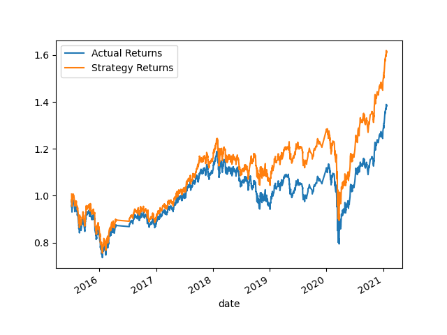
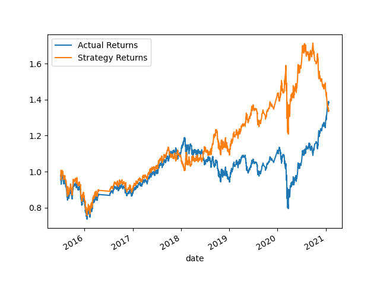

# FinTech-Mod14-Challenge

Files for Module 14 Challenge for FinTech Bootcamp

This is a Jupyter Notebook which backtests two machine learning models for a SMA long-short trading strategy.

## Analysis

This is the plot of the SVM model that was trained first. It performed well from the beginning of the period until early in 2019 when it started to diverge.

This is the plot of the logistic regression model that was trained second. We can see from the plot that this model was not as effective as the first model as the returns diverge by a greater quantity and more quickly than in the first model.

## Technologies

Languages:
* Python 3.7

Packages:
* Pandas - For data cleaning, processing, and visualization.
* Numpy - For data analysis and calculation.
* Path - To read data from CSV files.

## Installation Guide

To repeat the analysis on your own machine, simply open the Jupyter notebok in a web browser and run each cell. This will provide data analysis as well as visualization through a variety of graphs.

## Contributors

This project was completed as part of the FinTech Bootcamp at UC Berkeley Extension. Code contributions were made by myself in addition to the code provided by the program.

## License

MIT